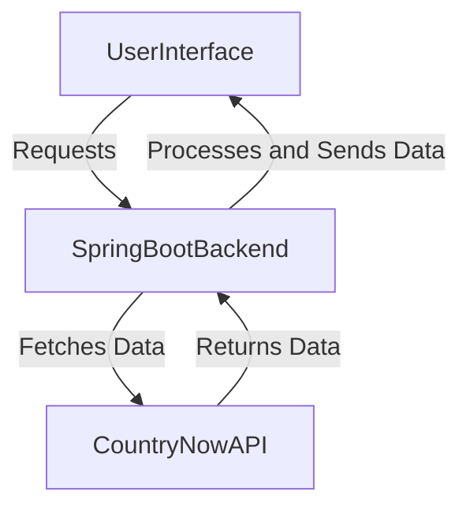
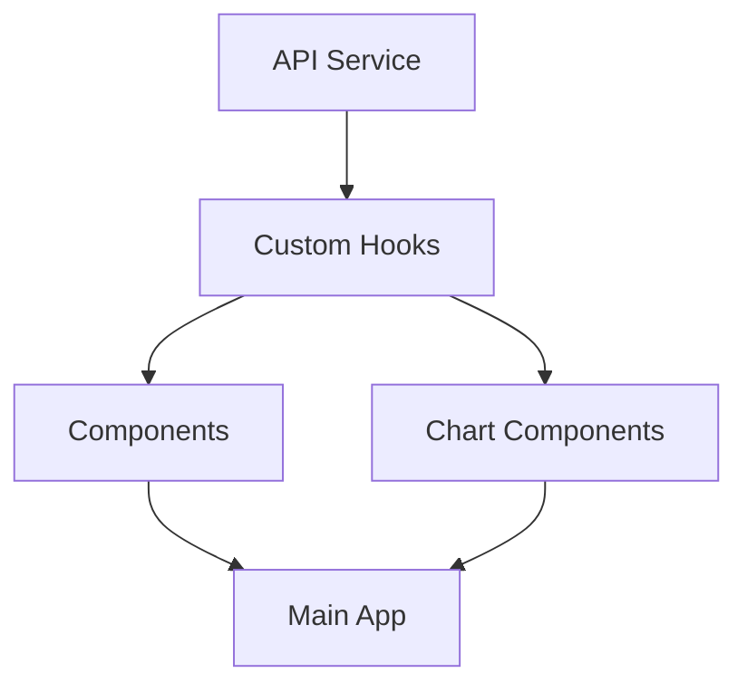

## Project Overview
This project involves creating a web application that visualizes population data for different countries using the CountriesNow API. The application consists of a Spring Boot backend that handles API consumption and data processing, and a React frontend for data visualization.
## Technical Stack

### Backend
- Framework: Spring BootCompa
- API Integration: RestTemplate/WebClient
- Data Transfer: DTOs (Data Transfer Objects)
### Frontend
- Framework: React.js
- HTTP Client: Axios
- Data Visualization: Chart.js and Recharts
- Styling: CSS
## Implementation Process

### 1. Backend Development (Spring Boot)
Instead of consuming the API directly in the frontend, I created a backend to establish a more robust and scalable architecture. This setup centralises business logic and data processing, enhancing maintainability and simplifying updates and debugging. It keeps the frontend lightweight and focused on the user interface, while the backend manages data tasks and error handling. Additionally, the backend allows for easy integration of new features or APIs without affecting the frontend and improves security by reducing direct API exposure. Overall, this approach optimizes performance and streamlines development..
Here's a simple mermaid diagram that illustrates the architecture with a frontend, backend, and API:


#### Project Structure
```
src/
├── main/
│   ├── java/
│   │   └── com/geoinfo/
│   │       ├── controllers/
│   │       ├── models/
│   │       ├── dto/
│   │       ├── services/
│   │       ├── exceptions/
│   │       ├── constants/
│   │       └── Application.java
│   └── resources/
│       └── application.properties
```
#### Key Components
1. **Models**
- Created Java classes to represent data structures: Using the model helps me maintain organized and consistent data handling throughout the application.
```java
public class Country {
    private String name;
    private String capital;
    private Population population;
    // getters, setters
}
```
2. **DTOs**
- Implemented DTOs for data transfer between layers: Using `dto` I can efficiently transfer data between layers, allowing me to encapsulate only the necessary data fields and reduce exposure.
```java
public class CountryResponse {
    private String countryName;
    private Long population;
    // getters, setters
}
```
3. **Services**
- Implemented service layer for API consumption and business logic: This enables me to manage data processing and interactions with external APIs while maintaining a clean separation of concerns.
```java
@Service
public class CountryService {
    private final HttpClient httpClient;
    
    public List<Country> getAllCountriesAndCapital() {
        // API consumption logic
    }
}
```
4. **Exception Handling**
- Implemented exception handling for consistent error management : It improves my debugging capabilities by making it easier to identify and resolve issues
```java
public class ApiException extends RuntimeException { 
	private final String errorCode;
	private final HttpStatus status;
		public ApiException(String message, String errorCode, HttpStatus status) { super(message); 
            this.errorCode = errorCode; 
            this.status = status; 
        } 
    }
```
5. **Constant**
   Created a constant class: This helps me to centralise the country API endpoints making it easier for me to maintain and also reduce duplicate strings ensuring consistency across the application.
```java
public final class ApiConstants {
    // API Endpoints
    public static final String BASE_URL = "https://countriesnow.space/api/v0.1";
    public static final String COUNTRIES_CAPITAL_ENDPOINT = "/countries/capital";
    public static final String COUNTRIES_FLAG_ENDPOINT = "/countries/flag/images";
}
```

### 2.  Frontend Implementation Details
#### Project Structure
1. Overview
```
src/
├── App.jsx                 # Main application component
├── assets/                 # Static assets
├── charts/                 # Chart components
├── components/            # Reusable UI components
├── hooks/                 # Custom React hooks
├── services/              # API services
└── styles/               # CSS stylesheets
```

2. Component Organization
```
components/
├── CityPopulation.jsx    # City-specific population display
├── Footer.jsx           # Application footer
├── Header.jsx          # Application header
└── HomePage.jsx        # Main landing page
```

3. Charting Components
```
charts/
├── BarChart.jsx                    # Bar chart visualization
├── CountrySearch.jsx               # Search functionality for countries
└── PopulationComparisonChart.jsx   # Comparative population analysis
```
#### Key Components

### 1. API Integration
I made use Axios for data fetching and create two types of charts: a bar chart and a line chart.
1. **Country Flag Endpoint**: This endpoint returns the flag of a specified country.
2. **Population Data Endpoint**: This endpoint provides population data for a specified country over time.
3. **City Data Endpoint**: This endpoints provides data for all cities in a country
#### Creating the User Interface

##### Search Bar for Country Flags

On the homepage, we implemented a search bar that allows users to search for a country. When a user enters a country name, Axios fetches the corresponding flag from the backend. This feature enhances user interaction by providing immediate visual feedback.
##### Modal for Country Selection

Once a user selects a country, a modal appears with two options:

1. **Compare Population**: This option allows users to compare the population of the selected country with another country. The data is fetched from the second endpoint and displayed in a bar chart.

2. **View Population Over Time**: This option displays the population data of the selected country over several years. The data is visualized using a line chart, providing insights into population trends.

### 2. Visualising Data with Charts
We created two chart components to visualise the data:

- **Bar Chart**: This chart compare the populations of two countries. It provides a clear visual representation of the differences in population size.
- **Line Chart**: This  displays the population of a selected country over time. It helps users understand how the population has changed year by year.

## Implementing the Chart Components

To create the charts, we used `rechart` Here's a brief overview of how each chart was implemented:
### Bar Chart Component
The bar chart component is designed to compare the populations of two countries. Here's how it works:
1. **Data Preparation**: Once the user selects the "Compare Population" option, we fetch the population data for the two countries using Axios.
2. **Chart Rendering**: The data is then passed to the bar chart component, which renders the chart using the charting library. The chart displays each country's population side by side for easy comparison.
### Line Chart Component
The line chart component visualises the population of a single country over time:
1. **Data Fetching**: When the user selects the "View Population Over Time" option, we fetch the historical population data for the selected country.
2. **Chart Rendering**: The data is fed into the line chart component, which plots the population against time. This visualisation helps users see trends and patterns in the population data.
