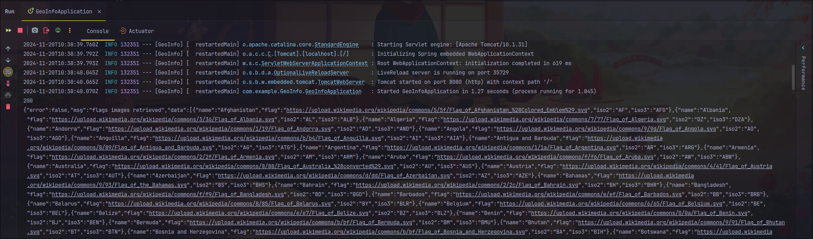
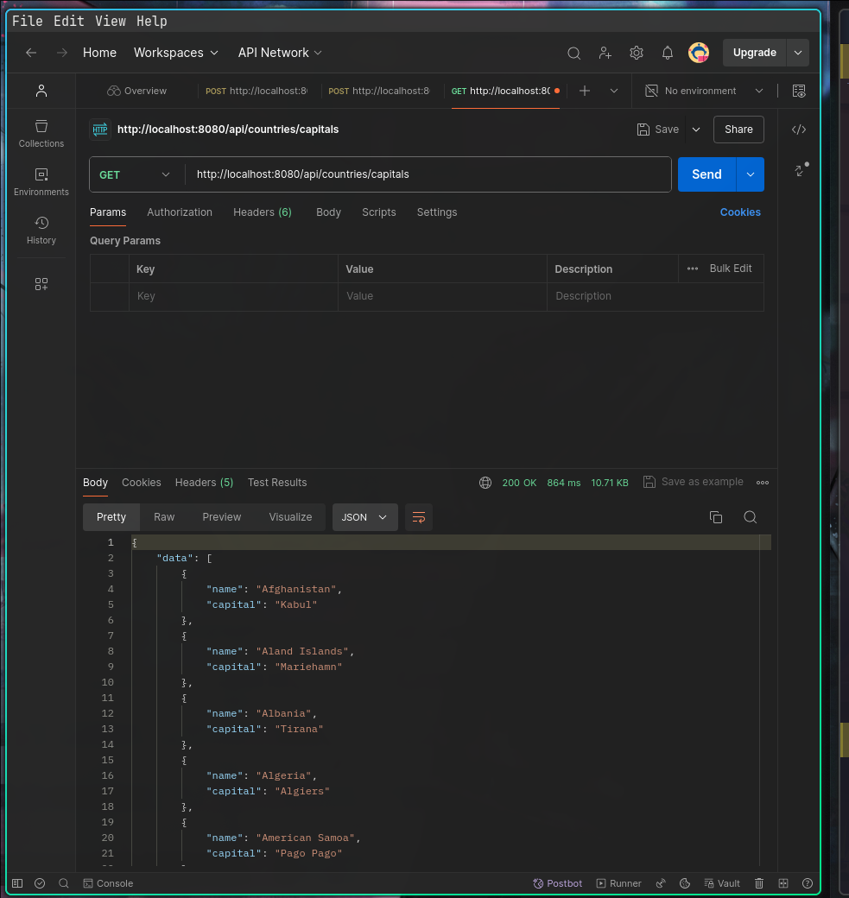

Todo
- First test and find a way to use HTTP CLIENT to get the data from the api
> I tested the first api, the code can be found below

## Getting the capital
```java
// Http client for getting the request
		HttpRequest getRequest = HttpRequest.newBuilder()
				.uri(new URI("https://countriesnow.space/api/v0.1/countries/capital"))
				.GET()
				.build();
		// Http client for sending the request
		HttpClient client = HttpClient.newHttpClient();
		HttpResponse<String> response = client.send(getRequest, HttpResponse.BodyHandlers.ofString());

		//Print the response to the console
		System.out.println(response.statusCode());
		System.out.println(response.body());
```
Before testing the application, i made sure to uncomment the spring data jpa before running as this then to affect the application 
while requesting for a database.
```xml
<!--		<dependency>-->
<!--			<groupId>org.springframework.boot</groupId>-->
<!--			<artifactId>spring-boot-starter-data-jpa</artifactId>-->
<!--		</dependency>-->
```

The next thing i am going to do next is to trying to get the data from the second api also
```java
HttpRequest getRequest = HttpRequest.newBuilder()
        //.uri(new URI("https://countriesnow.space/api/v0.1/countries/capital"))
        .uri(new URI("https://countriesnow.space/api/v0.1/countries/flag/images"))
        .GET()
        .build();
```


All was done here is just a change of the uri, replaced with the correct api for the flag.

The next thing i am going to do next is to trying to get the data from the thrid api 
```java
HttpRequest getRequest = HttpRequest.newBuilder()
        //.uri(new URI("https://countriesnow.space/api/v0.1/countries/capital"))
        //.uri(new URI("https://countriesnow.space/api/v0.1/countries/flag/images"))
        .uri(new URI("https://countriesnow.space/api/v0.1/countries/population/cities"))
        .GET()
        .build();
```

All was done here is just a change of the uri, replaced with the correct api for the flag.

----------
So what I plan to do next is create the services to handle the actual business logic of connecting to the api, so the 
services will handle the http client business logic...this helps to create separation in the code. 
- [ ] Update the document explain how you get the data and modularize the application be sure to include the error message
- and the screenshot of the data returned through the postman api.



## Getting the Flag


> Error_1
First error emcountered when i run the application for the first time, the error message
i was encountering indicate that the JSON file being deserialized contains in to the countryRequst contains a 
field named `error` that is not defined in the class. Basically Json library is trying to map the json field into
the properties of the class so without the error field it won't work. 

In other to solve the error, i added a new field to the dto
```java
public class CountryRequest {
        private String error;
    ...
}
```

> Error_2
First error encountered when i run the application for the first time, the error message
i was encountering indicate that the JSON file being deserialized contains in to the countryRequst contains a
field named `message` that is not defined in the class. Basically Json library is trying to map the json field into
the properties of the class so without the `msg` field it won't work.

```text
com.fasterxml.jackson.databind.exc.UnrecognizedPropertyException: Unrecognized field "msg" (class com.example.GeoInfo.dto.CountryRequest), not marked as ignorable (2 known properties: "error", "data"])
at [Source: REDACTED (`StreamReadFeature.INCLUDE_SOURCE_IN_LOCATION` disabled); line: 1, column: 23] (through reference chain: com.example.GeoInfo.dto.CountryRequest["msg"])
```
```java
public class CountryRequest {
        private String error;
        private String msg;
}
```
> Error_3 After added the extra fields to the countryRequestDTO, i got a new error was reqiesting me to have a field for 
> the other data like the `iso2` and `iso3` other data so i decided to use the `annotation` called `@JsonIgnorePropeties`
> this annotation helps to ignore other field in the json and only return neccessary and specifies fields.

```text
com.fasterxml.jackson.databind.exc.UnrecognizedPropertyException: Unrecognized field "iso2" (class com.example.GeoInfo.Entity.Country), not marked as ignorable (2 known properties: "capital", "name"])
 at [Source: REDACTED (`StreamReadFeature.INCLUDE_SOURCE_IN_LOCATION` disabled); line: 1, column: 113] (through reference chain: com.example.GeoInfo.dto.CountryRequest["data"]->java.util.ArrayList[0]->com.example.GeoInfo.Entity.Country["iso2"])
```

>Error_4 Getting the country flag
> ```text
.NullPointerException: Cannot invoke "com.example.GeoInfo.services.CountryFlagService.getCountryFlag(String)" because "this.countryFlagService" is null] with root cause

java.lang.NullPointerException: Cannot invoke "com.example.GeoInfo.services.CountryFlagService.getCountryFlag(String)" because "this.countryFlagService" is null
at com.example.GeoInfo.resources.CountryResources.getCountryFlag(CountryResources.java:26) ~[classes/:na]
at java.base/jdk.internal.reflect.DirectMethodHandleAccessor.invoke(DirectMethodHandleAccessor.java:103) ~[na:na]
at java.base/java.lang.reflect.Method.invoke(Method.java:580) ~[na:na]

```
