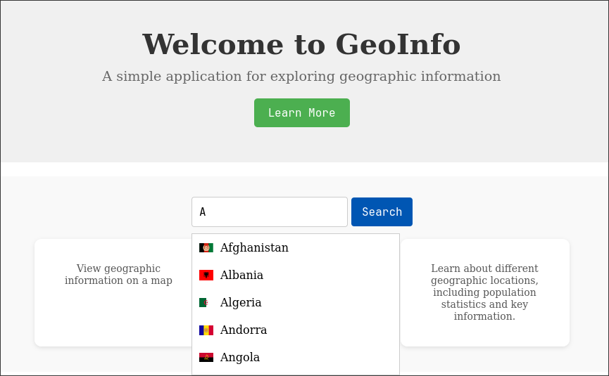

<p align="center"></p>

&nbsp;&nbsp;&nbsp;&nbsp;&nbsp;&nbsp;&nbsp;&nbsp;&nbsp;&nbsp;&nbsp;&nbsp;&nbsp;&nbsp;&nbsp;&nbsp;&nbsp;&nbsp;&nbsp;


[](https://travis-ci.org/thein3rovert/geoinfo)

[](https://github.com/thein3rovert/geoinfo/issues)


<p align="center">
  <a href="#key-features">Key Features</a> •
  <a href="#how-to-use">How To Use</a> •
  <a href="#download">Download</a> •
  <a href="#credits">Credits</a> •
  <a href="#related">Related</a> •
  <a href="#license">License</a>
</p>

## Basic Overview

GEOINFO is a web application built with Java, Spring Boot, and React, designed to analyze geographical data and provide insights through various indicators. It allows users to visualize historical geographical datasets and leverage them for predictive modeling.

<p align="center"></p>

#### Project Structure
```text
.
├── HELP.md                    # Documentation for help
├── mainReadme.md              # Main README for the project
├── mvnw                       # Maven wrapper script for Unix
├── mvnw.cmd                   # Maven wrapper script for Windows
├── pom.xml                    # Maven configuration file
├── readme.md                  # Project README
├── src                        # Source code directory
│   ├── main                   # Main application source
│   │   ├── java               # Java source files
│   │   │   └── com
│   │   │       └── example
│   │   │           └── GeoInfo
│   │   │               ├── dto                  # Data Transfer Objects
│   │   │               ├── entity               # Entity classes
│   │   │               ├── GeoInfoApplication.java  # Main application class
│   │   │               ├── resources            # Resource files
│   │   │               └── services             # Service classes
│   │   └── resources          # Application resources
│   └── test                   # Test source directory
│       └── java
│           └── com
│               └── example
│                   └── GeoInfo
└────────────────────────GeoInfoApplicationTests.java  # Test class
```

## Frontend Repository

The frontend for this project is located in a separate repository. You can access it by clicking the link below:

[Frontend Repository](https://github.com/your-username/frontend-repo-name)

Please follow the instructions in the frontend repository's README to set up and run the frontend application.

## Key Features

- **User-Friendly Interface**: Built with React for a seamless user experience.
- **Real-Time Data Visualization**: Visualize data dynamically.
- **Data Analysis**: Analyze geographical datasets for trends and insights.
- **RESTful API**: Interact with the backend using a well-defined API.
- **Country and Capital Data**: Retrieve detailed information about countries and their capitals.
- **City Population Statistics**: Access population data for various cities.
- **Country Flags**: Fetch images of country flags.
- **Modular Architecture**: Clean separation of concerns with models, DTOs, and services.
- **Error Handling**: Comprehensive error management to ensure smooth API interactions.
---
## How to Use
To clone and run this application, you'll need [Git](https://git-scm.com) and [Maven](https://maven.apache.org/download.cgi) installed on your computer. From your command line:

```bash
# Clone this repository
$ git clone https://github.com/thein3rovert/geoinfo.git

# Go into the backend directory
$ cd geoinfo/backend

# Build the application
$ mvn clean install

# Run the server
$ mvn spring-boot:run
```

Once the server is running, you can access the API at http://localhost:8080/api.
## Visualize the Learning Process
 <br>

To run the application, follow the steps outlined in the "How to Use" section. Ensure that you have the latest stable release of the dependencies.

Credits
```
    Java: The primary programming language used for the backend.
    Spring Boot: Framework used to create the RESTful API.
    React: Frontend library used for building the user interface.
```
## Related
GEOINFO Frontend: The frontend repository for the [GeoInfo]() application.
