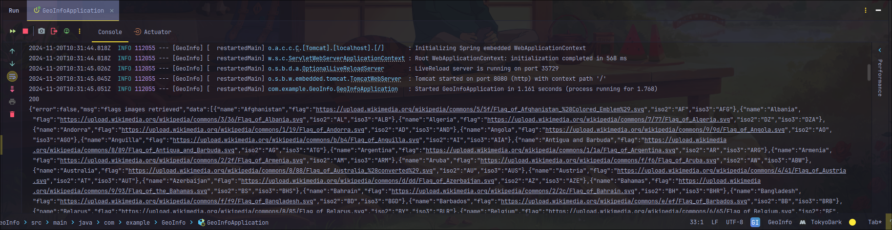
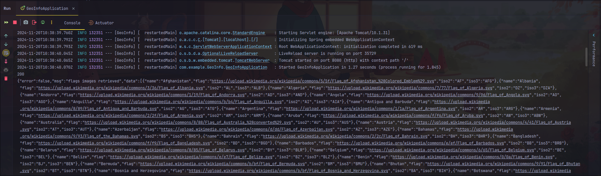
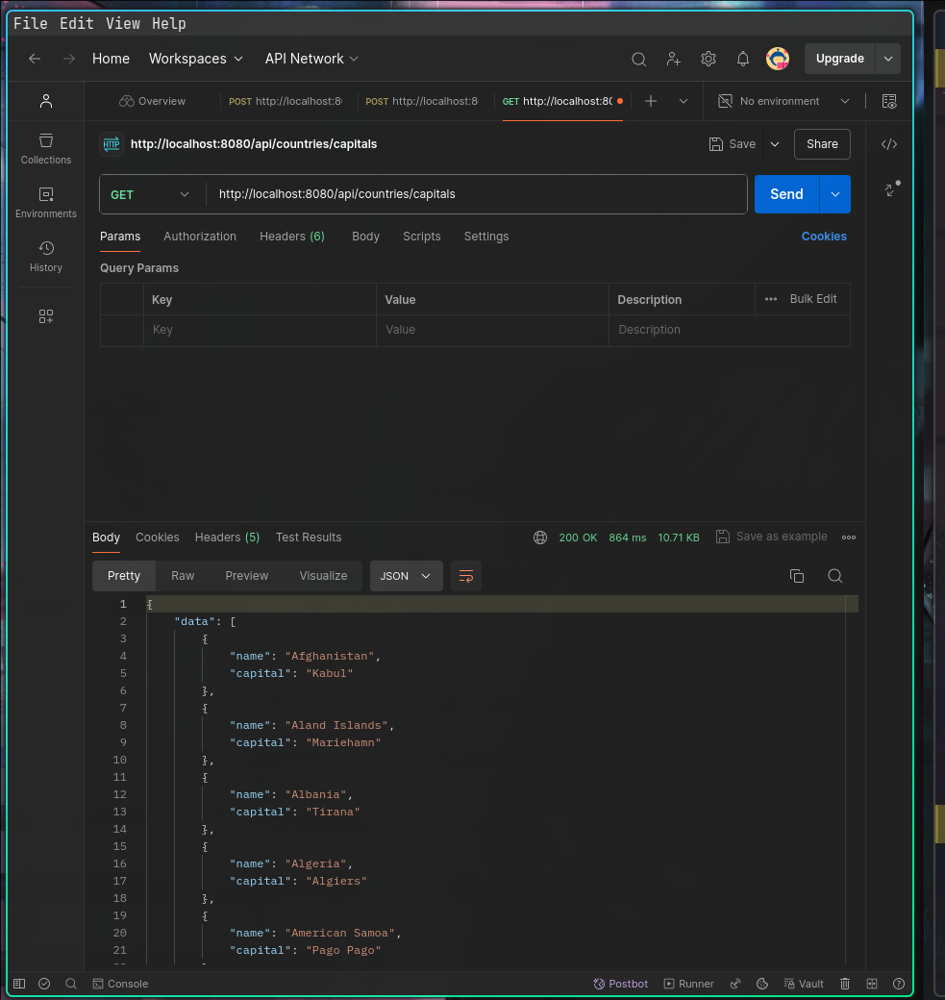

Todo
- [ ] Step by Step process on how I achieved the project
  - Understand the project requirement
  - Understand the project stack[java and react] - [Springboot and React]
  - Explore the api, I view the api and see what kind of json data i will be getting and also how large the data is.
  - Viewed the documentation attached to the document related to the api.


## The API Test
Before i approach creating the endpoint for the given api, i decided to first test getting the data from the endpoints
using using Httpclient and printing our the result to the console. 
- First test and find a way to use HTTP CLIENT to get the data from the api
> I tested the first api, the code can be found below

## Getting the capital
```java
// Http client for getting the request
		HttpRequest getRequest = HttpRequest.newBuilder()
				.uri(new URI("https://countriesnow.space/api/v0.1/countries/capital"))
				.GET()
				.build();
		// Http client for sending the request
		HttpClient client = HttpClient.newHttpClient();
		HttpResponse<String> response = client.send(getRequest, HttpResponse.BodyHandlers.ofString());

		//Print the response to the console
		System.out.println(response.statusCode());
		System.out.println(response.body());
```
Before testing the application, i made sure to uncomment the spring data jpa before running as this then to affect the application 
while requesting for a database.
```xml
<!--		<dependency>-->
<!--			<groupId>org.springframework.boot</groupId>-->
<!--			<artifactId>spring-boot-starter-data-jpa</artifactId>-->
<!--		</dependency>-->
```

The next thing i am going to do next is to trying to get the data from the second api also
```java
HttpRequest getRequest = HttpRequest.newBuilder()
        //.uri(new URI("https://countriesnow.space/api/v0.1/countries/capital"))
        .uri(new URI("https://countriesnow.space/api/v0.1/countries/flag/images"))
        .GET()
        .build();
```


All was done here is just a change of the uri, replaced with the correct api for the flag.

The next thing i am going to do next is to trying to get the data from the thrid api 
```java
HttpRequest getRequest = HttpRequest.newBuilder()
        //.uri(new URI("https://countriesnow.space/api/v0.1/countries/capital"))
        //.uri(new URI("https://countriesnow.space/api/v0.1/countries/flag/images"))
        .uri(new URI("https://countriesnow.space/api/v0.1/countries/population/cities"))
        .GET()
        .build();
```

All was done here is just a change of the uri, replaced with the correct api for the flag.

## Backend Implementation
- Create the model for each endpoints
- Created a data transfer object so that i can get the required data from the endpoint.

So what I plan to do next after creating the model and the dto is to  create the services to handle the actual business logic 
of connecting to the api and handle the http client business logic...this helps to create separation in the code. 


- [ ] Update the document explain how you get the data and modularize the application be sure to include the error message
- and the screenshot of the data returned through the postman api.

## Country and Capital
The first thing I did was create a country and capital model called `CountryEntity` this class represent a country including 
its name and capital. This class uses @Data annotation to automatically generate methods like getters and setters, `toSrtring`
and other useful methods.

After i then created the `dto` request for the country and capital entity caled `CountryRequest` this class handles 
the API response or requests, making it easir to process and manipulate data so we can get the data we want.

Then after i created a CountryService this is where the business logic for fetching the data are created, in this class
we have the `getAllCountriesAndCapital` method, this method interact with the external API to fetch a list of countries
and their capitals, using the a httppclient, objectmapper, and the created dto request, we were able to contruct an HTTP
GET request to the endpoints, send and receive request and response.
Below is a image shoiwing the successful retrieval of the data needed and the error solved during the process



> Error_1
First error emcountered when i run the application for the first time, the error message
i was encountering indicate that the JSON file being deserialized contains in to the countryRequst contains a
field named `error` that is not defined in the class. Basically Json library is trying to map the json field into
the properties of the class so without the error field it won't work.

In other to solve the error, i added a new field to the dto
```java
public class CountryRequest {
        private String error;
    ...
}
```

> Error_2
First error encountered when i run the application for the first time, the error message
i was encountering indicate that the JSON file being deserialized contains in to the countryRequst contains a
field named `message` that is not defined in the class. Basically Json library is trying to map the json field into
the properties of the class so without the `msg` field it won't work.

```text
com.fasterxml.jackson.databind.exc.UnrecognizedPropertyException: Unrecognized field "msg" (class com.example.GeoInfo.dto.CountryRequest), not marked as ignorable (2 known properties: "error", "data"])
at [Source: REDACTED (`StreamReadFeature.INCLUDE_SOURCE_IN_LOCATION` disabled); line: 1, column: 23] (through reference chain: com.example.GeoInfo.dto.CountryRequest["msg"])
```
```java
public class CountryRequest {
        private String error;
        private String msg;
}
```
> Error_3 After added the extra fields to the countryRequestDTO, i got a new error was reqiesting me to have a field for
> the other data like the `iso2` and `iso3` other data so i decided to use the `annotation` called `@JsonIgnorePropeties`
> this annotation helps to ignore other field in the json and only return neccessary and specifies fields.

```text
com.fasterxml.jackson.databind.exc.UnrecognizedPropertyException: Unrecognized field "iso2" (class com.example.GeoInfo.Entity.Country), not marked as ignorable (2 known properties: "capital", "name"])
 at [Source: REDACTED (`StreamReadFeature.INCLUDE_SOURCE_IN_LOCATION` disabled); line: 1, column: 113] (through reference chain: com.example.GeoInfo.dto.CountryRequest["data"]->java.util.ArrayList[0]->com.example.GeoInfo.Entity.Country["iso2"])
```

## City and Population
After created the country and capital entity, the next endpoint was the country and city, the task was to fetch the data 
the api and make it accessible to the client, so i created the `cityPopulationEntity` that contain three fields `city`,`country`
and a list of `populationCounts`also created a populationCountyEntity with fields `year` and `value`.

After i created the `cityPopulationServices` this clas helps to handle the business logic for sending a request to the api
and returning the respose to the client in json format, it does this using the `httpClient` which is responsible for sending 
request the server and recieving s response.

Finally i created in the `countryResources` class, i created the `population/cities` endpoints, the endpoints has a method
`getCityPopulation` and its goal is to return the response ton the client after getting it from the `getCountryPopulation` 
method in the services class.

TODO: PERFORM TEST AND ADD SCREENSHOT

### CountryFlag
The third endpoint contain response data containing the country flag, similar to the other two endpoints method above 
the model and the dto was created in other to have a more refined control over the data needed, then the `CountryFlag` 
services was created resposbile for handling the `httpClient` logic responsible for the request and the resposne of data 
from the api server.

The service class contains the method `getCountryFlag` and takes in a parameter `country`, this mean if we pass in the name
of the country we want can then get the required `flag` for that country. I then created a Json String format to insert the 
variable country into the JSON object.
> Error_4 Getting the country flag
 ```text
.NullPointerException: Cannot invoke "com.example.GeoInfo.services.CountryFlagService.getCountryFlag(String)" because "this.countryFlagService" is null] with root cause

java.lang.NullPointerException: Cannot invoke "com.example.GeoInfo.services.CountryFlagService.getCountryFlag(String)" because "this.countryFlagService" is null
at com.example.GeoInfo.resources.CountryResources.getCountryFlag(CountryResources.java:26) ~[classes/:na]
at java.base/jdk.internal.reflect.DirectMethodHandleAccessor.invoke(DirectMethodHandleAccessor.java:103) ~[na:na]
at java.base/java.lang.reflect.Method.invoke(Method.java:580) ~[na:na]

```

Now i am able to get the country flag..i decided not to use the post endpoints because i was having error with it so i view to documationand found out 
there is an api for to get all the flag images, so i believe that will be more useful for my usecase and then later i can 
come back to work on the POST api to get just one flag.

Additionally, I create a constant class to store API endpoint URLs for images, cities, and capitals, this helps in
code organization, maintainability, and readability.
```java
public class Constants {
    public static final String IMAGE_API_URL = "https://countriesnow.space/api/v0.1/countries/flag/images";
    public static final String CITIES_API_URL = "https://countriesnow.space/api/v0.1/countries/population/cities";
    public static final String CAPITAL_API_URL = "https://countriesnow.space/api/v0.1/countries/capital";
}
```

SO the next thing i want to work on next is the frontend, just to get something going and displaying the data 


